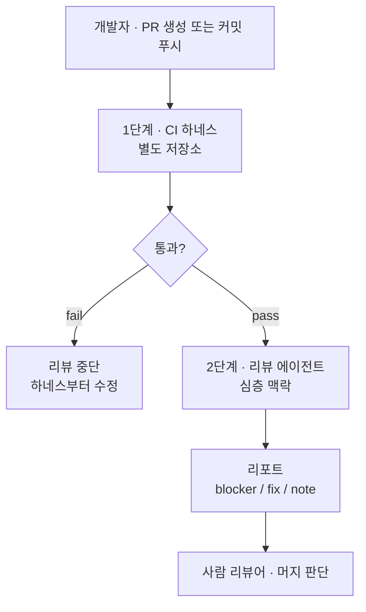

# code-review-agent

CI 하네스를 통과한 diff를 받아, 하네스가 잡을 수 없는 결함만 보고하는 Claude Code 서브에이전트.

## 파이프라인



- 1단계 입력: 커밋, 1단계 출력: pass 또는 fail
- 2단계 입력: diff, PR 본문, 컨벤션 문서, 하네스 결과(주어지면)
- 2단계 방법: self-refutation. 재현 조건과 결과를 짝으로 못 쓰면 후보를 버림
- 2단계 출력: `blocker` `fix` `note` 리포트. 등급은 권고이고 머지 판단은 사람이 함
- 에이전트는 read-only. `Bash` 는 `git diff` 수집에만 사용

## 단계별 책임

| 1단계 · 하네스 | 2단계 · 에이전트 |
|---|---|
| lint, format, import order | taint flow, authorization |
| type check | race condition, idempotency |
| unit, integration test | resource leak, query cost |
| dead code, unused symbol | boundary condition, error handling |
| 문자열 밖 오탈자 | 코드와 모순되는 주석·문서·식별자 |

스타일과 포맷 지적은 하지 않습니다.

## 2단계 검증 항목

| 영역 | 항목 |
|---|---|
| Taint flow | untrusted source → privileged sink, SQL/command injection, SSRF, path traversal, zip slip, 템플릿 주입 |
| Authorization | IDOR, BOLA, 테넌트 스코프 누락, per-route 검사만 있고 per-object 검사 없음 |
| Secret | 로그·URL·아티팩트·스택 트레이스 유출, 기본 권한 설정 파일, 비상수 시간 비교 |
| Concurrency | race condition, TOCTOU, data race, check-then-act, await 가로지르는 lock, deadlock |
| Idempotency | at-least-once 재전송 중복 처리, 조건부 갱신 누락, 유니크 제약 부재 |
| Resource | connection pool exhaustion, cursor leak, fd leak, unbounded allocation, timer·goroutine leak |
| Query cost | N+1, full scan, deep OFFSET, 인덱스 미사용, 장기 트랜잭션 lock, lock 승격 |
| Error handling | swallowed exception, fail-open, partial failure를 success로 보고 |
| Boundary | off-by-one, null과 falsy 구분, empty·at-limit·overflow |
| Time | timezone, DST, monotonic과 wall clock, clock skew, TTL 산술 |
| Interface | 스키마 마이그레이션 양방향 호환, 설정 키·공개 API 변경 |
| Supply chain | mutable tag 참조, cache poisoning, 토큰 스코프 과다, 신뢰 못 할 트리거의 비밀값 노출 |

## 파일

| 파일 | 보고 언어 |
|---|---|
| `agents/code-reviewer.md` | 영어 |
| `agents/code-reviewer-ko.md` | 한국어 |

규칙은 동일하고 보고 언어만 다릅니다. `description` 이 비슷해 자동 위임 시 선택이 갈리므로 하나만
설치하세요.

## 설치

```bash
# 프로젝트 단위
mkdir -p <project>/.claude/agents && cp agents/code-reviewer-ko.md <project>/.claude/agents/

# 계정 전역
mkdir -p ~/.claude/agents && cp agents/code-reviewer-ko.md ~/.claude/agents/
```

## 호출

| 방식 | 사용법 |
|---|---|
| 자동 위임 | 코드 변경 후 "리뷰해줘" |
| 명시적 호출 | `@"code-reviewer-ko (agent)"` |
| 세션 고정 | `claude --agent code-reviewer-ko` |

## 등급

| 등급 | 조치 | 기준 |
|---|---|---|
| `blocker` | 머지 전 | data loss, authorization bypass, outage, 비가역 손상 |
| `fix` | 이번 PR | 조건부 오동작, resource exhaustion, 장애 은폐 |
| `note` | 기록 | 현재 무해, 다음 변경에서 파손 |

## 태그

| 태그 | 범위 |
|---|---|
| `correctness` | 오동작, race, boundary, swallowed failure, idempotency, time |
| `security` | trust boundary, authorization, secret |
| `resource` | memory, connection, handle, lock, query cost |
| `interface` | 공개 API, 저장 포맷, 설정 키, 호환성 |
| `clarity` | 코드와 모순되는 이름·주석·문서 |
| `tests` | 누락된 검증, 변경과 무관하게 통과하는 검증 |

## 리포트 형식

```
리뷰 결과 · <파일 수>개 파일 · blocker <n>건 · fix <n>건 · note <n>건

[<등급>] <한 줄 제목>
  <경로>:<행 범위> · <태그>[, <태그>]

  근거  어떤 불변식 또는 신뢰 경계가 깨지는가
  재현  구체적 입력 또는 상태 → 구체적 결과
  판단  왜 이 등급인가. 가정이 있으면 가정과 가정이 깨질 때의 등급

  패치
      <해당 행 범위에 적용되는 코드. 모르면 비우고 이유를 쓴다>

보고하지 않음
  - <항목> — <제외 이유>
```

- 근거, 재현, 판단은 필수
- 패치는 생략 가능. 생략 시 그 자리에 이유를 적음
- 패치는 인용 행 범위에 원본 들여쓰기로 적용됨
- 보고하지 않음은 생략 불가

## 데모 PR

| 언어 · PR | 기능 | 코드 | blocker | fix | note |
|---|---|---|---|---|---|
| [Python](https://github.com/lowgiant/code-review-agent/pull/1) | 테넌트 CSV 익스포트 다운로드 API | 98행 | 1 | 1 | 1 |
| [TypeScript](https://github.com/lowgiant/code-review-agent/pull/2) | 결제 제공자 웹훅 수신 | 90행 | 2 | 2 | 1 |
| [Go](https://github.com/lowgiant/code-review-agent/pull/3) | 회전식 감사 로그 기록기 | 123행 | 2 | 2 | 1 |
| [Rust](https://github.com/lowgiant/code-review-agent/pull/4) | 테넌트별 요청 제한 | 68행 | 1 | 2 | 2 |
| [Java](https://github.com/lowgiant/code-review-agent/pull/5) | 대시보드 보고서 검색 | 93행 | 1 | 3 | 1 |
| [Shell](https://github.com/lowgiant/code-review-agent/pull/6) | 호스트 배포 스크립트 | 44행 | 2 | 2 | 1 |
| [SQL](https://github.com/lowgiant/code-review-agent/pull/7) | orders 이행 시각 마이그레이션 | 20행 | 2 | 1 | 2 |
| [GitHub Actions](https://github.com/lowgiant/code-review-agent/pull/8) | PR 검사 워크플로 | 43행 | 2 | 2 | 1 |

- 데모 PR의 코드에는 결함을 의도적으로 넣었습니다
- `demo/` 접두 브랜치에만 존재하고 main에 반영되지 않으며 머지하지 않습니다
- 운영 코드로 가져가지 마세요
- GitHub Actions 사례는 `.github/workflows/` 가 아닌 경로에 있어 실행되지 않습니다

## 설계 원칙

- **보고 임계는 재현 가능성 하나.** 숫자 임계 없음. 입력과 잘못된 결과를 짝으로 제시 못하면 버림
- **보안은 taint flow로 판단.** 함수 이름이 아니라 source와 sink를 양쪽 다 지목
- **privileged-by-design은 제외.** plugin loader, 설정 callable의 동적 import, 설정 템플릿 렌더링은
  운영자 입력 실행이므로 취약점 아님. untrusted 값이 그 경로에 도달하는 변경만 지적
- **프로젝트 규약 우선.** `AGENTS.md`, `CLAUDE.md`, `CONTRIBUTING.md` 를 먼저 읽고 충돌 시 그 문서를 따름
- **read-only.** 테스트·lint·format·build 미실행. 수정과 커밋 없이 패치는 텍스트로만 제안

## 커스터마이즈

프로젝트별 규칙은 에이전트 파일이 아니라 해당 레포의 `AGENTS.md` 또는 `CLAUDE.md` 에 둡니다.
에이전트가 그 문서를 자기 기본값보다 우선시하므로 에이전트 파일은 모든 프로젝트에서 재사용됩니다.

| 항목 | 위치 |
|---|---|
| 등급 정의 | 에이전트의 "등급 3단계" |
| 태그 집합 | 에이전트의 "태그 6종" |
| 하네스 경계 | 에이전트의 "역할 분담" |
| 리포트 구조 | 에이전트의 "리포트 형식" |
| 모델, 도구 권한 | frontmatter `model`, `tools` |

## 라이선스

MIT. `LICENSE` 참조.
